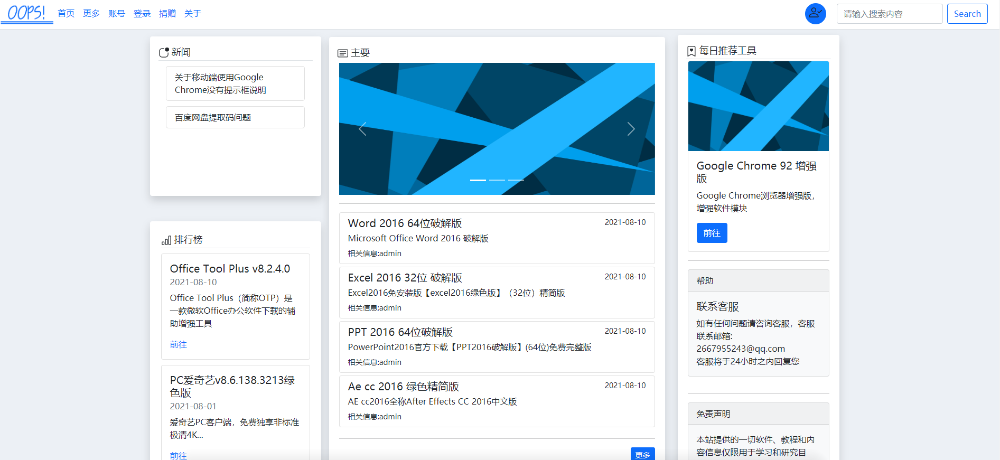
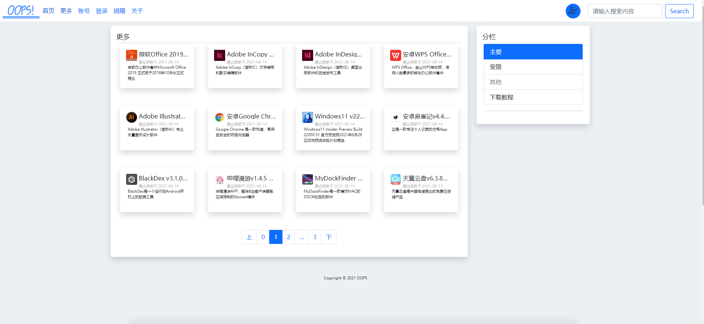

## Django-Vue-OOPS

> django rest framework + vue +bootstrap + redis前后端分离的资源网站小项目

## 环境

> * Python 3.9
>   * Django 3.2
>   * Django rest framework 3.12.4
> * Vue 3
> * Bootstrap 5.0.2

> **后端项目文件为project**
>
> **前端项目文件为demo**
>
> 其他后端依赖请参考project/requirements.txt文件有详细说明

## 界面

## support

微信公众号：OOPS哎呀

## License

Copyright © 2021 [caro1xxx](https://github.com/caro1xxx).
This project is [OOPS](https://github.com/caro1xxx/OOPS-WebFullstack) licensed.

